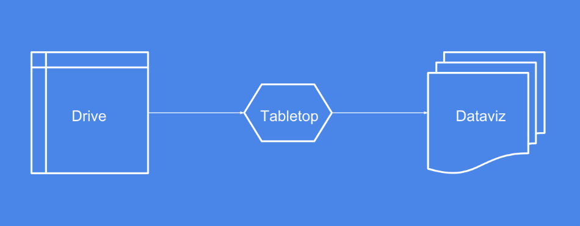
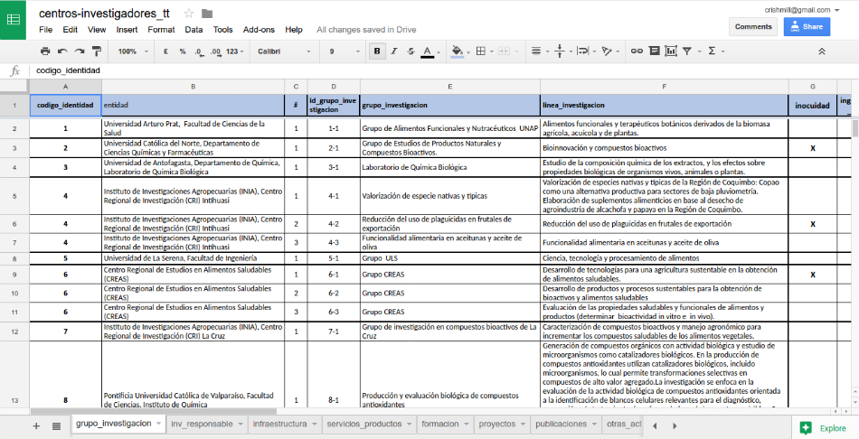
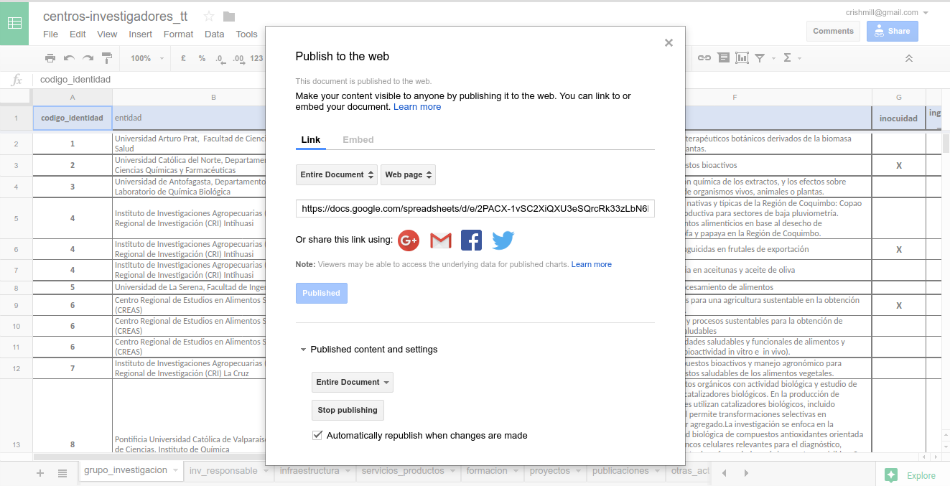
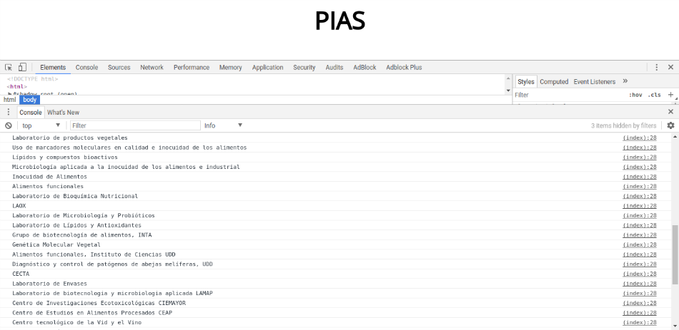

# PIAS: Estructura y Actualización de Datos
<p style="font-size:0.8em">Documentos preparado por Cristian Hernández</p></b><p style="font-size:0.8em">cris@crishernandez.co</p></b><p style="font-size:0.8em">Septiembre del 2017</p>

> ##### Resumen
En este reporte se plantea lo que se considera la forma más eficiente de servir de datos a la visualización enconmendada por el Programa Estratégico Nacional Transforma Alimentos, en los objetivos específicos OE1 (investigadores y laboratorios) y OE2 (centros de desarrollo, prueba y pilotaje)

#### A. **Requerimiento**
De acuerdo a las conversaciones surgidas en las reuniones de avance del proyecto, el cliente busca un método que no requiera la contratación de nuevas asesorías y/o servicios dedicados como nuevos servidores, para el mantenimiento y la actualización de los datos con los cuales se construirán las visualizaciones. En lo posible, y tal como se mencionó por el cliente, utilizar herramientas de uso generalizado, similares a un entorno *Microsoft Office*.

#### B. **Solución propuesta**
Teniendo en mente el requerimiento se exploraron diversas soluciones. Lo que se escoge finalmente como espacio que aloje los datos es [**Google Drive**](https://www.google.com/drive/), en específico **Google Spreadsheets**, que provee un espacio en la nube de edición colaborativa, y similar a un formato de hojas de un libro excel.

Para llamar los datos y que estos sean servidos para las visualizaciones se utilizará la herramienta [**Tabletop**](https://github.com/jsoma/tabletop), la cual está desarrollada en el lenguaje de programación *JavaScript*. Este módulo permite llamar cada hoja (*sheet*) del documento en Drive, en un formato de objetos, sobre los cuales se construirán las visualizaciones.

#### C. **Estructura de datos**
La estructura de datos propuesta es la siguiente:



En esta estructura de datos, manteniendo un formato pre-establecido de libro de hojas alojado en Drive, hecho en Google Spreadsheets, se alimenta a la visualización de datos a través de la utilización de Tabletop.

De esta manera se elimina la preocupación de configurar servidores especiales para la visualización de datos, y se hace dinámica en el sentido de actualizarse al mismo momento que se actualizan los datos. Solo basta refrescar la página donde se alojala visualización en el explorador.

#### D. Ejemplo del flujo de datos
Para que los datos puedan ser utilizados directamente desde Google Spreadsheets, se necesita realizar los siguientes pasos:

- Subir o crear un documento en Google Spreadsheets. En este caso se ha alojado la tabla enviada por el cliente en Google Drive:



- Para que Tabletop pueda leer un libro alojado en Drive, el documento debe hacerse público en la web, de la siguiente forma: ```File > Publish to the web```. Luego copiar el link que Drive entrega:



- Insertar el link que nos entrega Drive en la función JavaScript de Tabletop para leer los datos, o solamente identificador o **key** del documento, de la siguiente forma:

```JavaScript
function drawChart(data) {
  // La visualización se incluye aquí !! ;)
}
var pias = '1k1evTzwDEkuKoZQs9GT4Ny4ywPKXlXJzQuB8kZcfhBs'; // Key del documento en Drive
var options = { key: pias,
                callback: draw
              }
function renderSpreadsheetData() {
    Tabletop.init(options)
}
function draw(data, tabletop) {
  drawChart(data);
}
renderSpreadsheetData();
```

- Una vez que se puede acceder a los datos en el documento, podemos hacer un test. En este caso haremos una impresión en la consola del explorador con todos los nombres de los Grupos de Investigación:

```JavaScript
function drawChart(data) {
  // GRUPOS DE INVESTIGACIÓN
  var grupos_investigacion = data.grupo_investigacion.elements;
  for (var i = 0; i < grupos_investigacion.length; i++) {
    console.log(grupos_investigacion[i].grupo_investigacion);
  }
}
```

Esto produce el siguiente render en el explorador:



#### E. Siguientes pasos
Si el cliente está conforme con la forma propuesta para el ingreso y actualización de los datos, ya se puede comenzar a programar las visualizaciones de los datos provistos. Un ejemplo de lo que se propone para la visualización, se presentará en un documento adjunto.
